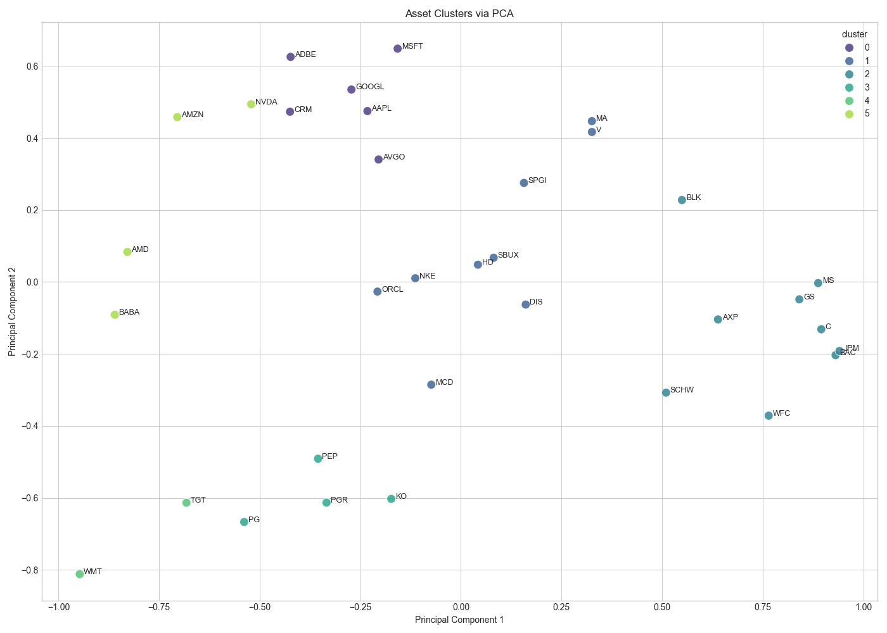
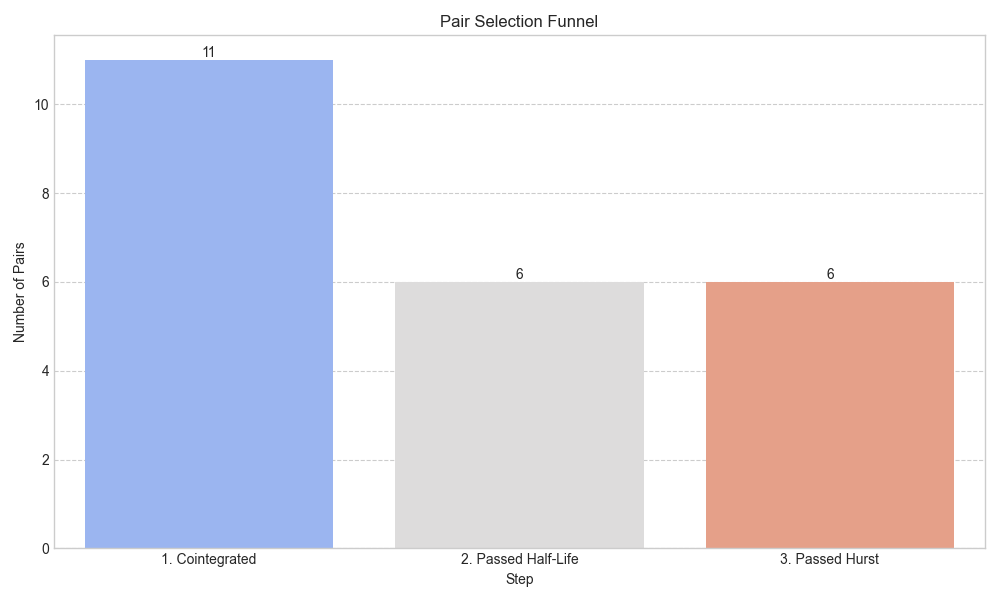
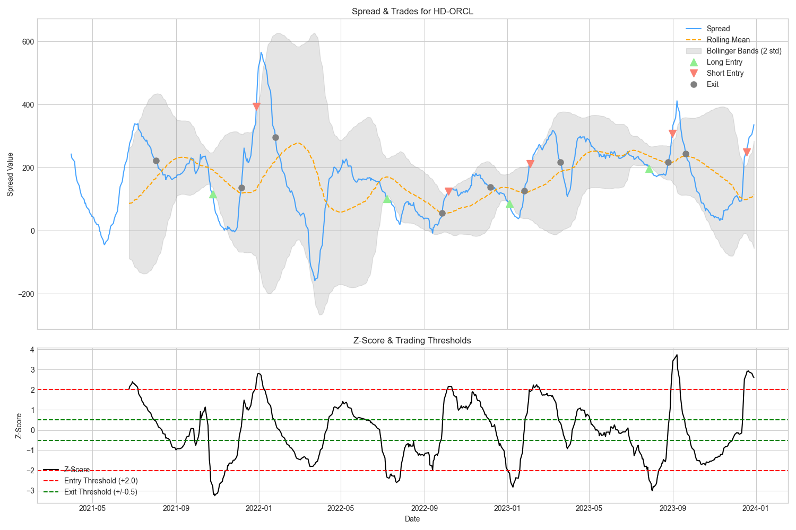
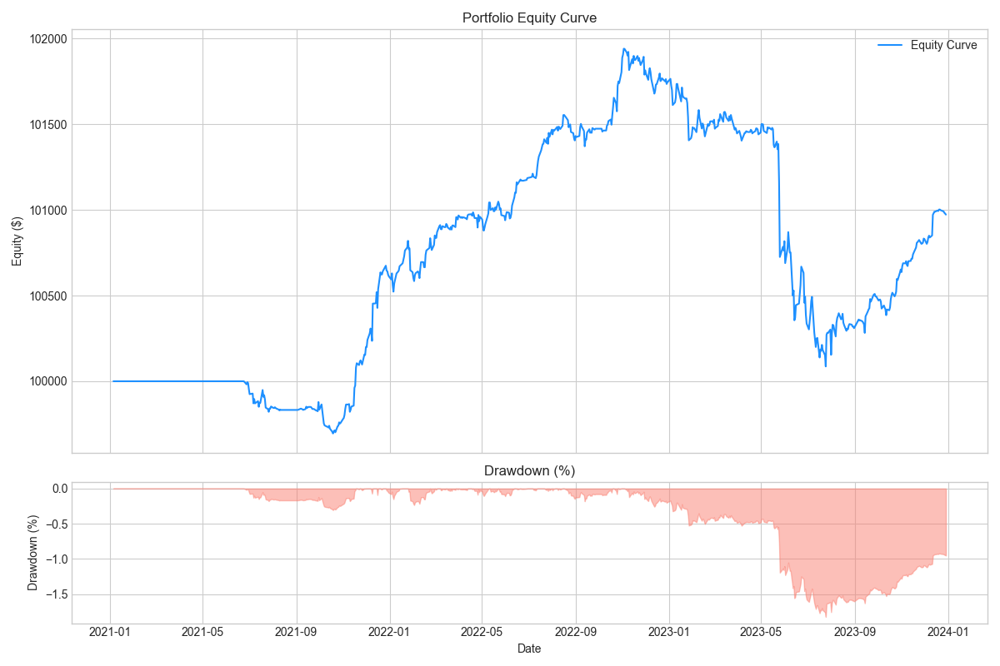
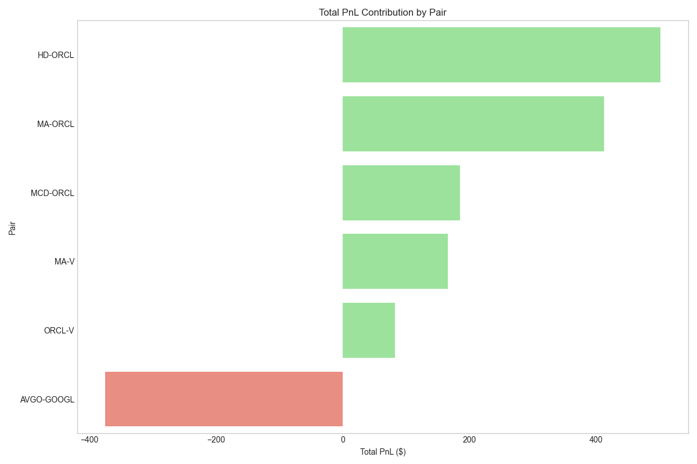

# Adaptive-Equity-StatArb: A Machine Learning & Cointegration Pipeline

A robust quantitative trading framework that identifies and trades mean-reverting asset pairs using Unsupervised Learning (PCA & K-Means clustering) and multi-stage statistical filtering with a solid backtesting engine for trade simulation.

## Performance Overview


This pipeline moves beyond traditional sector-based pairing by using machine learning to uncover latent statistical relationships between assets.

### Key Metrics (Out-of-Sample)
* **Sharpe Ratio**: 0.51
* **Max Drawdown**: -1.82%
* **Total PnL**: ~$1,000

The following results represent the Out-of-Sample performance (2021–2024). To ensure the integrity of these metrics, the following strategy constraints were used:

| Parameter | Value |
|--- | --- |
| `PCA_VARIANCE_THRESHOLD` | 0.95 |
| `MAX_HURST_EXPONENT` |	0.45 |
| `ENTRY_Z / EXIT_Z` |	2.0 / 0.5	|
| `STOP_LOSS_Z_THRESHOLD`	| 4.0	|
| `COMMISSION_BPS` |	1.5 |

---

## Pipeline Architecture

The system utilizes a "Funnel" approach to ensure only the most robust pairs are traded, minimizing capital exposure to "random walk" or trending spreads.

### 1. Asset Segmentation (ML Layer)
* **Dimensionality Reduction**: Principal Component Analysis (PCA) is applied to the return correlation matrix, dynamically retaining components that explain **95% of total variance**.
* **Unsupervised Clustering**: K-Means clustering is performed on the PCA-transformed space to group assets with similar statistical features into 6 distinct clusters.

### 2. Statistical Selection Funnel
Within each cluster, pairs must pass a three-tier rigorous test:
* **Engle-Granger Cointegration**: Ensures a long-term equilibrium relationship ($p < 0.05$).
* **Ornstein-Uhlenbeck Half-Life**: Rejects pairs with mean reversion speeds that are too fast (< 20 days) or too slow (> 250 days).
* **Hurst Exponent Filter**: Strictly accepts only series with **H < 0.45** to confirm mean-reverting behavior and filter out "drifting" pairs.

###### Note: These paramaters can be tweaked.

### 3. Backtesting Engine & Execution
The engine is designed to simulate institutional-grade execution by strictly separating **Signal Generation** from **Trade Execution**.

* **Lazy Hedging Logic**: Signals are generated based on Adjusted Close prices, but orders are filled at the **next day’s Open**. This eliminates "look-ahead bias" and accounts for overnight risk.
* **Accounting Integrity**: The engine tracks cash and share holdings explicitly, initializing each pair with its allocated capital base to provide accurate Sharpe and Drawdown metrics.
* **Dynamic Sizing**: Position sizes are scaled based on the 60-day rolling volatility of the spread to maintain a constant **1% risk per trade**.
---

## Analysis Reports

### Selection Funnel
The filtering process is highly selective, as seen in the reduction from cointegrated candidates to tradeable pairs.


### Pair Dynamics (Case Study: HD-ORCL)
Detailed view of entry/exit signals, Bollinger Band thresholds, and Z-score behavior.


### Portfolio Performance
Cumulative equity curve and drawdown profile for the out-of-sample period.


Portfolio performance was dragged down by the `AVGO-GOOGL` pair, as can be seen below:


---

## Installation & Usage

1. **Clone the repository**:
   ```bash
   git clone https://github.com/adk7712/ml-pairs-trading-pipeline
   ```

2. **Install dependencies:**
    ```bash
    pip install -r requirements.txt
    ```

3. **Edit config.py to adjust tickers, risk parameters, or statistical thresholds.**

4. **Run the pipeline:**
    ```bash
    python main.py
    ```
    or
    ```bash
    python3 main.py
    ```

## Future Work
* **Risk-Parity Capital Allocation**: Move away from equal-weighting toward volatility-targeted allocation to improve the portfolio's overall Sharpe ratio.

---

## 📜 License

Distributed under the **MIT License**. See the `LICENSE` file for more information.

> **Disclaimer**: This software is for educational and research purposes only. It is not financial advice. The author is not responsible for any financial losses incurred from the use of this code.
